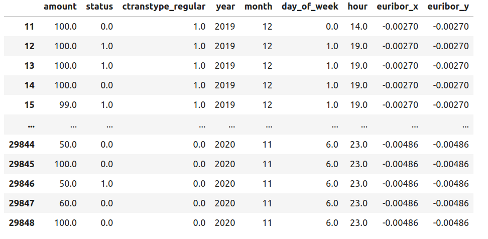
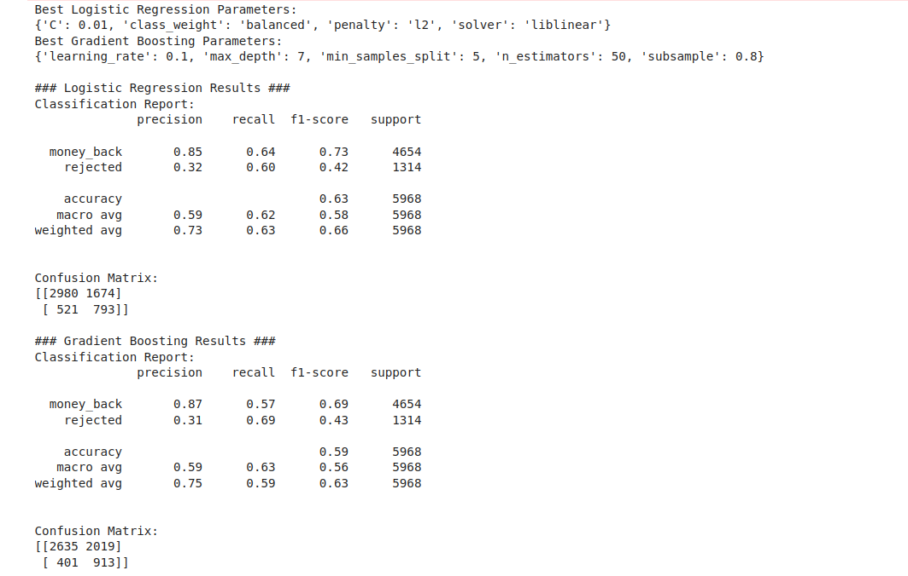
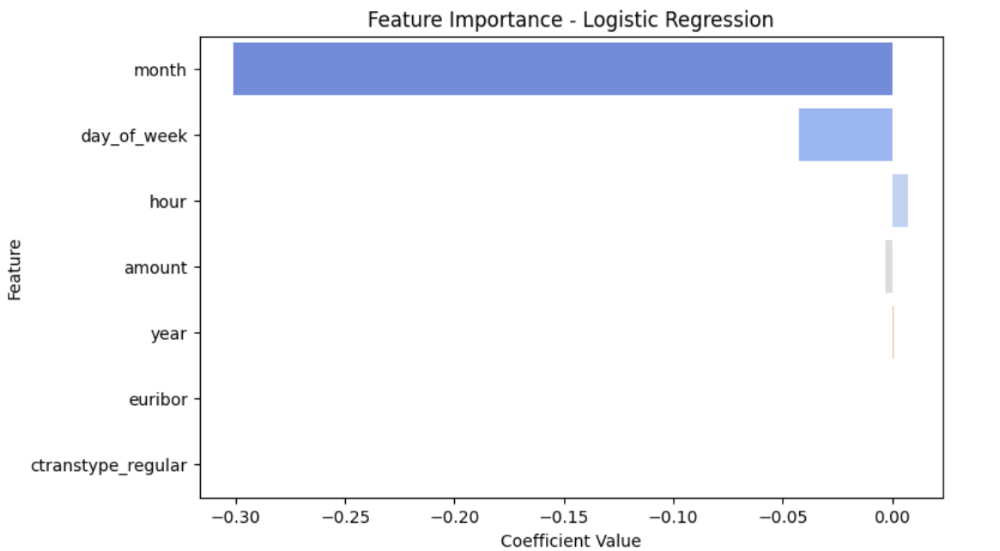
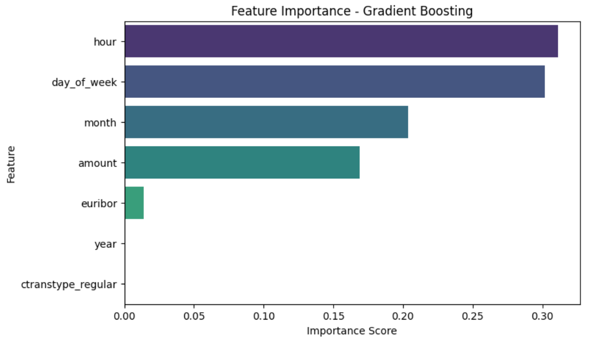
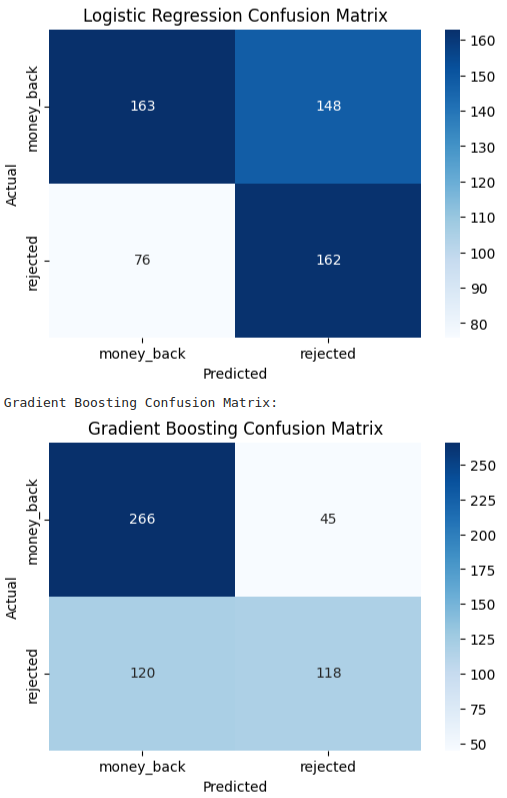
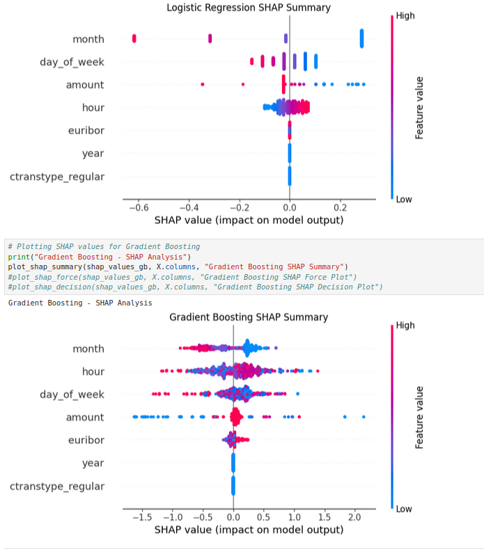

# monayvi
Segon projecte Data Science UOC - Business Payments

Autores: Montserrat Lopez, Victor Bassas,  Andres Henao

Descripción: Archivo Readme del proyecto de analisis de la empresa Business Payments

Creado: 27/11/2024
Versión: 1.0  
Correos: cutmountain@uoc.edu, vbassasb@uoc.edu, ahenaoa@uoc.edu

## Estructura de los directorios
### data
Contiene los ficheros .csv originales del proyecto que son:
- cash_request.csv : contiene las peticiones de cash de los clientes y los datos asociados
- fees.csv: contiene las comisiones asociadas a las operaciones de cash request por usuario
- Lexique-Data_Analyst.xlsx : describe los campos de los ficheros anteriores

### notebooks
En esta carpeta se encuentran los ficheros de jupyter notebook utilizados para la elaboración de los análisis y modelos

### utils

Hemos creado este folder para compartir código que se reuse en todo el proyecto.
Funciones en data.py ([data utils]([https://github.com/ahenao/aguacate-aljoan/blob/main/utils/data.py](https://github.com/DataScience-UOC-projects/monayvi/blob/main/utils/data.py))): 
- clase Datasets(): instancia la clase para modificar los datasets
- create_cash_cohorts(): devuelve el nuevo dataframe con los cohhortes para la tabla cash
- get_users_by_cohort(): devuelve un dataframe con número de usuarios por cohorte
- get_original_datasets(): devuelve una tupla con dos dataframes: cash_original y fees_original

Para usar los módulos de utils en scripts se hace 
```
from utils.data import Datasets
```
y para usarlos desde jupyter notebook, hay que agregar el path:

```
import sys, os
sys.path.append(os.getcwd().replace('/notebooks',''))  # Replace '/notebooks' with current directory name
from utils.data import Datasets
```

```
datasets = Datasets()
cash_cohorts = datasets.create_cash_cohorts()
original_cash, original_fees = datasets.get_original_datasets()
users_by_cohort = datasets.get_users_by_cohort()
```
### ini

Contiene el fichero markdown ```enunciado.md``` con el enunciado del proyecto

## Contexto social y económico

Las fechas de estudio coinciden con la explosión de la pandemia de COVID durante el primer trimestre de 2020 y la progresiva recuperación de la actividad en los meses de mayo, junio y julio.
Los intereses para préstamos de dinero interbancario en Europa estaban a tasas negativas y en Estados Unidos y Reino Unido a tasas positivas cercanas al 0%

En esta tabla se muestra el Euribor para el año 2019


Y la tabla correspondiente al año 2020:


En un ejercicio de scrapping básico, hemos obtenido las tablas del euríbor para ser usadas luego posiblemente como variable exógena. Pandas tiene la función de leer tablas html si se encuentran en páginas bien de forma estructuradas:

```
import pandas as pd
link_euribor_2020 = "https://www.euribor-rates.eu/es/tipos-de-interes-euribor-por-ano/2020/"
tablas_2020 = pd.read_html(link_euribor_2020)
euribor2020_df = tablas_2020[0]
euribor2020_df.to_csv("../data/euribor.csv")
```


Para el mercado británico y americano el gráfico muestra el valor del indice LIBOR , equivalente al Euribor para el Euro.


Valores negativos del índice Euribor implica que _se debería devolver menos dinero que el principal solicitado_. Con intereses negativos un impago de una parte del capital solicitado, no tiene tanto impacto para el banco como en el caso de intereses positivos.

## Análisis e investigaciones de los datos en original_cash y original_fees

**Análisis de operaciones en el tiempo**

En los graficos se presentan las distribuciones de solicitudes por hora y por día. Se encuentra un pico de solicitudes para los martes (una disminución en fines de semana), así como un pico de solicitudes a las 16:00 y una distribución de solicitudes centrada en las horas laborables. Esto nos indica que agregar features como hora y día de la semana puede proveer información a modelos de predicción.La codificación de los días de semana es de 0-6, siendo 0: lunes y 6: Domingo.


## Modelos de clasificación

Hemos encontrado en la tabla original de cash, que alrededor del 70% de status corresponde a money_back y cerca a un 30% a rejected. Las operaciones rejected (en su ayoría) han pasado por un proceso de revisión manual: Una incidencia. Esto implica dedicación horaria de personal que podría dedicarse a tareas que puedan destinarse a mejorar la rentabilidad del negocio (estrategias de mercado, análisis de mercado, etc). Así que un modelo de clasificación que permita predecir si una transacción tiene alta probabilidad de ser cancelada podría limitar el número de incidencias y repercutir en las ganancias del negocio (sin reducir el personal de la empresa, sino haciendo que sus tareas sean de mayor impacto: Automatizar tareas repetitivas).

Hemos comenzado por hacer feature engineering de las variables temporales relevantes, y hemos filtrado las variables de amount, status (0: money_back, 1: rejected), ctranstype_regular (1:regular, 0:instantánea). Además hemos añadido la variable exäogena del euribor para probar su importancia. Además de que es una variable de la cual se hace forecast y puede usarse para predicciones futuras.



Hemos intentado dos modelos de clasificación: Regresión Logística, y GradientBoosting. Hemos hecho una optimización de hiperparámetros para clasificar el status. En el caso de regresión logística hemos variado la regularización. En el caso de GradientBoosting hemos optimizado número de estimadores, learning_rate, max_depth de los arboles de decisión, min_samples_split. A continuación se muestran los mejores hiperparámetros.



Y los resultados de las matrices de confusión, así como de la importancia de las variables de clasificación. Hemos además añadido un análisis de valores Shapley (concepto que nace de la teor¡ia de juegos, para asignar la importancia de cada variable en el rendimiento global del model).









Algunas conclusiones:
- La variable exogena euribor aun no tiene un papel de alta importancia, aunque es relevante en los arboles de decision. Puede conservarse, y refinarse a futuro
- Logistic regression da mucha mas importancia el mes, se necesitan mas datos temporales o tener en cuenta eliminarla del modelo
- Amount grandes de prestamos tienen relativamente bajo impacto en el status. Juegan mas variables como el dia de la semana y la hora
- La hora (shapley) tiene un efecto claro en el arbol de decision: A altas horas se hace mas importante su peso para que el status sea rechazado

