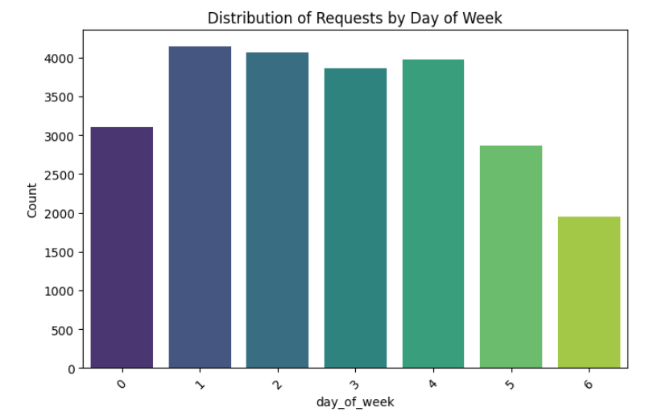
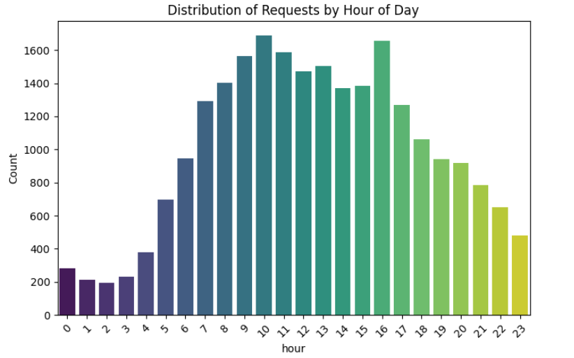

# monayvi
Segon projecte Data Science UOC - Business Payments

Autores: Montserrat Lopez, Victor Bassas,  Andres Henao

Descripción: Archivo Readme del proyecto de analisis de la empresa Business Payments

Creado: 27/11/2024
Versión: 1.0
Correos: cutmountain@uoc.edu, vbassasb@uoc.edu, ahenaoa@uoc.edu

## Estructura de los directorios
### data
Contiene los ficheros .csv originales del proyecto que son:
- cash_request.csv : contiene las peticiones de cash de los clientes y los datos asociados
- fees.csv: contiene las comisiones asociadas a las operaciones de cash request por usuario
- Lexique-Data_Analyst.xlsx : describe los campos de los ficheros anteriores

### notebooks
En esta carpeta se encuentran los ficheros de jupyter notebook utilizados para la elaboración de los análisis y modelos

### utils

Hemos creado este folder para compartir código que se reuse en todo el proyecto.
Funciones en data.py ([data utils]([https://github.com/ahenao/aguacate-aljoan/blob/main/utils/data.py](https://github.com/DataScience-UOC-projects/monayvi/blob/main/utils/data.py))): 
- clase Datasets(): instancia la clase para modificar los datasets
- create_cash_cohorts(): devuelve el nuevo dataframe con los cohhortes para la tabla cash
- get_users_by_cohort(): devuelve un dataframe con número de usuarios por cohorte
- get_original_datasets(): devuelve una tupla con dos dataframes: cash_original y fees_original

Para usar los módulos de utils en scripts se hace 
```
from utils.data import Datasets
```
y para usarlos desde jupyter notebook, hay que agregar el path:

```
import sys, os
sys.path.append(os.getcwd().replace('/notebooks',''))  # Replace '/notebooks' with current directory name
from utils.data import Datasets
```

```
datasets = Datasets()
cash_cohorts = datasets.create_cash_cohorts()
original_cash, original_fees = datasets.get_original_datasets()
users_by_cohort = datasets.get_users_by_cohort()
```
### ini

Contiene el fichero markdown ```enunciado.md``` con el enunciado del proyecto

## Contexto social y económico

Las fechas de estudio coinciden con la explosión de la pandemia de COVID durante el primer trimestre de 2020 y la progresiva recuperación de la actividad en los meses de mayo, junio y julio.
Los intereses para préstamos de dinero interbancario en Europa estaban a tasas negativas y en Estados Unidos y Reino Unido a tasas positivas cercanas al 0%

En esta tabla se muestra el Euribor para el año 2019


Y la tabla correspondiente al año 2020:


Para el mercado británico y americano el gráfico muestra el valor del indice LIBOR , equivalente al Euribor para el Euro.


Valores negativos del índice Euribor implica que _se debería devolver menos dinero que el principal solicitado_. Con intereses negativos un impago de una parte del capital solicitado no tiene tanto impacto como en el caso de intereses positivos.

## Análisis e investigaciones de los datos en original_cash y original_fees

**Análisis de operaciones en el tiempo**

En los graficos se presentan las distribuciones de solicitudes por hora y por día. Se encuentra un pico de solicitudes para los martes (una disminución en fines de semana), así como un pico de solicitudes a las 16:00 y una distribución de solicitudes centrada en las horas laborables. Esto nos indica que agregar features como hora y día de la semana puede proveer información a modelos de predicción.La codificación de los días de semana es de 0-6, siendo 0: lunes y 6: Domingo.




